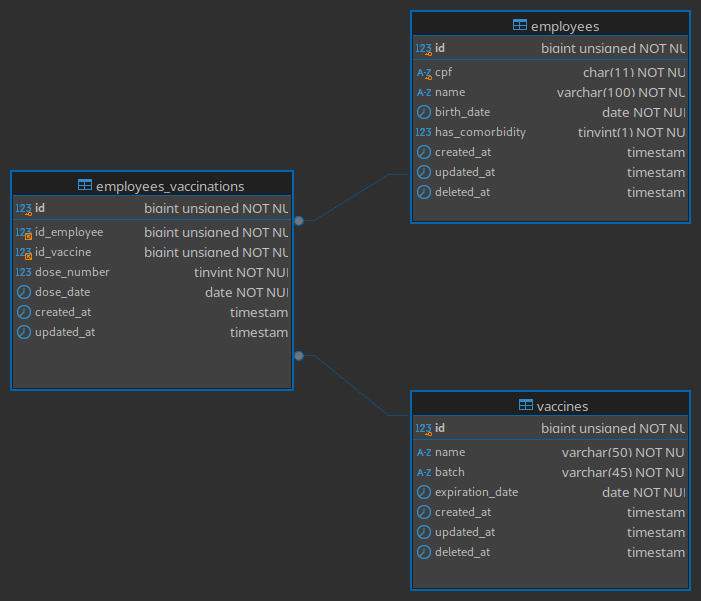

# Software Documentation

## 1. How to set up the project

### Installation Requirements
- Docker (Version used: 27.2.1)
- Docker compose (Version used: 2.29.5)

### Docker containers and versions
- Nginx
- PHP: 8.3
- MySQL: 8.4.0
- Redis
- Composer
- NPM: 18.20
- Artisan

## Step 1: Clone the Repository
```bash
git clone https://github.com/jpoliveira08/covid-vaccination-control
```
Navigate into the project directory:
```bash
cd covid-vaccination-control
```

## Step 2: Set up the project environment variables
Nesta primeira parte é para configurar as variáveis de ambiente do projeto. Com isso basta alterar as credenciais de acordo com o desejado ou deixar como está
```bash
cp .env.example .env
```

## Step 3: Set up the laravel environment variables
```bash
cd app
```
Também deve executar mesmo comando para copiar o .env de exemplo
```bash
cp .env.example .env
```
Neste caso será modificado o trecho abaixo de:
```bash
DB_CONNECTION=sqlite
# DB_HOST=127.0.0.1
# DB_PORT=3306
# DB_DATABASE=laravel
# DB_USERNAME=root
# DB_PASSWORD=
```
Para:
```bash
DB_CONNECTION=mysql
DB_HOST=mysql
DB_PORT=3306
DB_DATABASE=laravel
DB_USERNAME=root
DB_PASSWORD=
```
Customizando apenas as credenciais do banco de dados as quais já foram definidas no .env do ambiente (Step 2), de modo que DB_CONNECTION e DB_HOST mantenham-se inalterados.

## Step 4: Install the Laravel app
Para instalar a aplicação deve-se estar no diretório covid-vaccination-control/ e executar o seguinte comando:
```bash
docker compose run --rm composer install
```
Gere a chave com o comando
```bash
docker compose run --rm artisan key:generate
```

## Step 5: Run database migrations
```bash
docker compose run --rm artisan migrate
```
Caso seja desejável popular dados na aplicação basta executar o seguinte comando
```bash
docker compose run --rm artisan db:seed
```

## Step 6: Install front-end dependencies
```bash
docker compose run --rm npm run build
```

### Para executar os testes basta executar o comando
```bash
docker compose run --rm artisan test
```

## 2. Database structure
This database has been structured according to best normalization practices, ensuring data integrity. The image belows show the database diagram.


- The employees table stores information about each employee.

- The vaccines table holds information about each vaccine

- The employees_vaccinations table serves as a junction table between the employees and vaccines tables, recording each vaccination dose an employee receives

### Key Normalization Principles Applied:

<strong>1NF (First Normal Form):</strong> Each table has atomic columns without repeating groups, ensuring each field contains only one value per record. For instance, cpf in the employees table represent unique, single values for each employee.

<strong>2NF (Second Normal Form):</strong> All non-key fields are fully functionally dependent on the primary key of their respective tables.

## Application Overview

<p>
A aplicação tem como objetivo o registro de vacinação dos funcionários. Com isso, a mesma possui dois CRUD's, um de vacinas e outro de funcionários.
</p>

<p>
A aplicação possui três telas principais, sendo elas Home, Employees e Vaccines, e na rota de Employees o usuário ainda é direcionado para outras visões de acordo com a operação a ser realizada.
</p>

### Cadastro de vacciness
<p>
Ao acessar a tela de Vacinas, é apresentada uma tabela para o usuário, a qual é construída com PowerGrid e LiveWire.
</p>
<p>
Nesta tabela, o usuário pode ordenar pelas colunas (name e batch), e também pode pesquisar os registros utilizando os dados presentes nestas duas colunas. A tabela também possui paginação.
</p>
<p>
A tela apresenta todos os botões de operações do CRUD, o botão de inserir fica na parte superior, enquanto as demais ações de visualização, edição e exlusão estão localizadas na última coluna da tabela.
</p>
<p>
Pelo cadastro de vacina possuir poucos campos, o mesmo foi implementado utilizando um Modal para facilitar a usabilidade do sistema, de modo que o usuário consiga realizar operaões na mesma tela que visualiza os registros.
</p>
<p>
O modal possui validações no HTML, que informa a obrigatoriedade de todos os campos, e também possui validação no backend, de modo a apresentar as mensagens de erros vindas do backend com a biblioteca toastr do javascript.
</p>
<p>
As requisições são realizadas utilizando vanilla javascript com fetch API.
</p>
<p>
Como no banco de dados é utilizado onDeleteCascade na tabela de relacionamente de vaccines e employess, caso seja excluída uma vacina que possui relação com algum employee o registro é registro é excluído automaticamente.
</p>

### Cadastro de employess
<p>
Ao acessar a tela de employees também é apresentado uma tabela construída com PowerGrid e LiveWire.
</p>

<p>
Nesta tabela o usuário pode ordenar e pesquisar pelas colunas (name e cpf), assim como a tabela de vacinas esta também possui paginação.

</p>

<p>
A tela apresenta todos os botões de operações do CRUD, o botão de inserir fica na parte superior, enquanto as demais ações de visualização, edição e exlusão estão localizadas na última coluna da tabela.
</p>